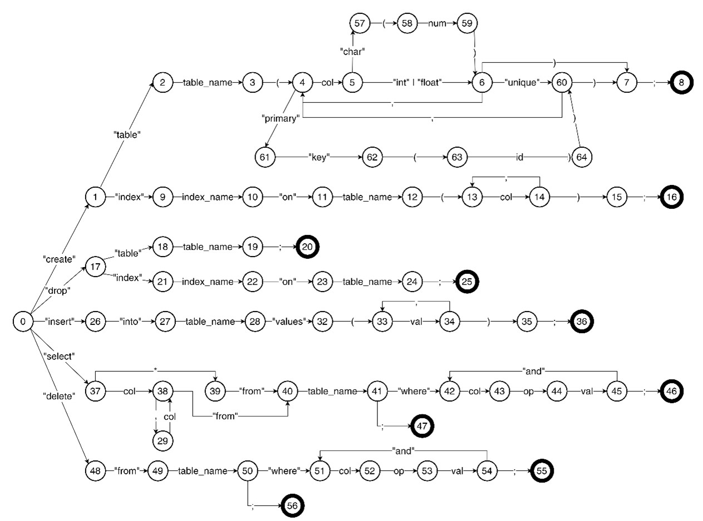

# DMS Python Client

## 运行及测试

安装依赖：

```bash
# 建议使用虚拟环境
$ python -m venv env

$ source env/bin/activate  # Linux / macOS
> env\Scripts\activate     # Windows

(env) $ pip install -r requirements.txt
```

配置 Master 地址：

```python
# client/config.py

class Config:
    def __init__(self):
        self.master_host = '127.0.0.1'
        self.master_port = 9090

```

运行客户端：

```bash
# 交互模式
(env) $ python app.py
Welcome to SQL!
Type .exit to quit.
>>> create table person(id int, primary key(id));
Table person created
>>> .exit
 
# 批量模式
(env) $ python app.py -b input.txt

# 批量模式下，指定输出文件
(env) $ python app.py -b input.txt -o output.txt

# 批量模式下，不回显语句
(env) $ python app.py -b input.txt --no-echo
```

测试：

```bash
# 本机打开测试 master/region 服务器，用于测试 thrift 连接
# master 运行在 127.0.0.1:9090，region 运行在 127.0.0.1:[9200-9205]
(env) $ python -m test.test_thrift

# 测试 interpreter 模块
(env) $ python -m test.test_interpreter
```

## 实现细节

Interpreter 使用 recursive descent parser，状态机如下图：


